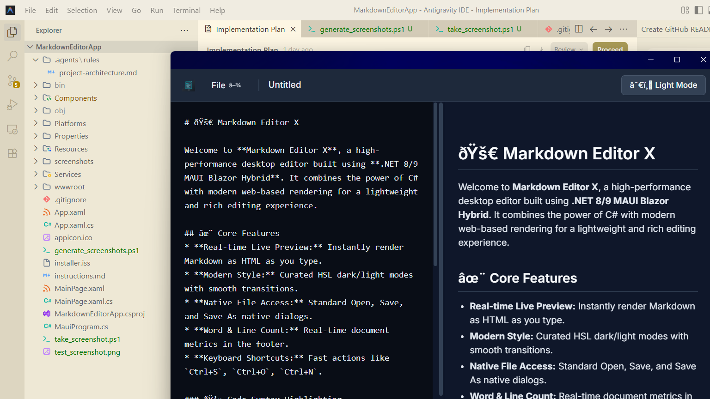
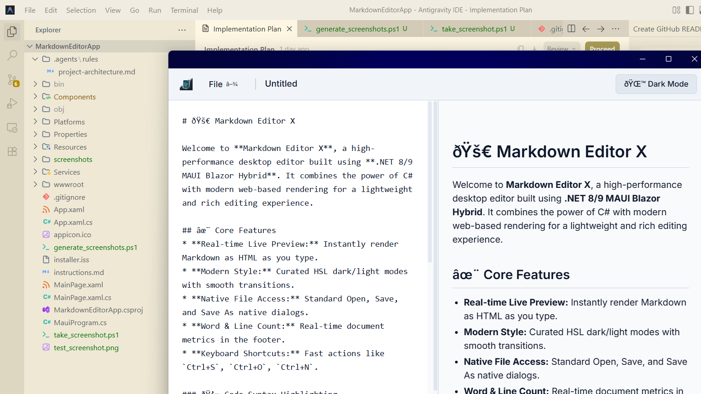

# 🚀 Markdown Editor X

**Markdown Editor X** is a modern, lightweight, and blazing-fast Windows desktop Markdown editor built entirely within the **.NET 8/9** ecosystem. By using **.NET MAUI Blazor Hybrid**, the application blends high-performance C# backend operations with beautiful, responsive, web-based frontend rendering.

---

## 📸 Screenshots

Here is a preview of Markdown Editor X showcasing its split-pane editor, live preview rendering, dynamic document metrics, and clean user interface:

### 🌙 Dark Mode (Default)


### ☀️ Light Mode


---

## ✨ Key Features

- **Real-Time Live Preview:** High-performance rendering of Markdown to HTML instantly as you type.
- **Advanced Markdown Support:** Uses the compliant and fast `Markdig` library, configured with advanced extensions to support rich tables, blockquotes, lists, and formatted code blocks.
- **Premium Styling & Themes:** Modern dark slate and crisp light interfaces designed with smooth CSS transitions, custom scrollbars, and optimized typography fonts.
- **Native OS File Integration:** Asynchronous file operations via .NET MAUI's `FilePicker` and WinUI's native `FileSavePicker` to safely open, save, and save as `.md` or `.txt` files directly on Windows.
- **Status Metrics:** A live footer showing word count, line count, and a document save status indicator ("Saved" vs "Unsaved Changes").
- **Productivity Keyboard Shortcuts:** Quick-access commands to speed up your writing process:
  - `Ctrl + N`: New File (Clears editor)
  - `Ctrl + O`: Open File... (Launches native file picker)
  - `Ctrl + S`: Save / Save As (Saves content back to disk)
- **Windows Integration:** Configured to center on the screen upon boot at a standard 1200x800 size, and features native window minimized, maximized, and exit controls.

---

## 🛠️ Technology Stack

- **Shell / Host:** .NET MAUI (WinUI 3 backend for Windows Desktop).
- **Frontend UI:** Blazor Hybrid embedding a native Chromium-based `BlazorWebView` (reduces memory consumption compared to Electron).
- **Core Processing:** 100% C# for workspace logic, state, and native operations.
- **Markdown Processing:** [Markdig](https://github.com/xoofx/markdig) (.NET Markdown-to-HTML parser).
- **Styling:** Isolated Vanilla CSS for modular design controls.
- **Installer Packaging:** Inno Setup Compiler configuration (`installer.iss`).

---

## 📂 Project Structure

- **`Components/`**: Blazor Hybrid views.
  - [`MarkdownWorkspace.razor`](file:///c:/Projects/MarkdownEditorApp/Components/MarkdownWorkspace.razor): The layout pane hosting the `<textarea>` editor, file menus, theme toggle, preview container, and footer status bar.
  - [`MarkdownWorkspace.razor.css`](file:///c:/Projects/MarkdownEditorApp/Components/MarkdownWorkspace.razor.css): CSS isolation for custom themes, scrollbars, headers, dropdowns, and deep CSS overrides (`::deep`) for HTML tags parsed from Markdown.
- **`Services/`**: Native services injected into components.
  - [`FileService.cs`](file:///c:/Projects/MarkdownEditorApp/Services/FileService.cs): Asynchronous local file reads and writes using native Win32/WinUI file-save and file-pick dialog boundaries.
  - [`WindowService.cs`](file:///c:/Projects/MarkdownEditorApp/Services/WindowService.cs): Interops with native Windows handles (`HWND`) to control window minimize, maximize, and application quit commands.
- **`MauiProgram.cs`**: Main application setup configuring the frame, window size boundaries (1200x800), lifecycle hooks, and dependency injection.
- **`installer.iss`**: Script to generate a desktop installer via Inno Setup.

---

## 🚀 Getting Started

### Prerequisites
- **Visual Studio 2022** (v17.8 or higher) with the **.NET Multi-platform App UI development** workload installed.
- **.NET 8.0 SDK** or newer.

### Build and Run
To restore dependencies, build the Windows binary, and run the editor, execute the following commands in the project root:

```powershell
# Restore NuGet packages
dotnet restore

# Build and run the app for Windows
dotnet build -f net8.0-windows10.0.19041.0
dotnet run -f net8.0-windows10.0.19041.0
```

### Packaging & Distribution
To compile a production-ready package with binaries ready for installer generation:

1. Build the release profile:
   ```powershell
   dotnet publish -f net8.0-windows10.0.19041.0 -c Release
   ```
2. Compile the installer:
   Open the Inno Setup Compiler, load [`installer.iss`](file:///c:/Projects/MarkdownEditorApp/installer.iss), and compile. The executable setup file will be generated in `C:\Projects\Installers\MarkdownEditorX_Setup.exe`.
